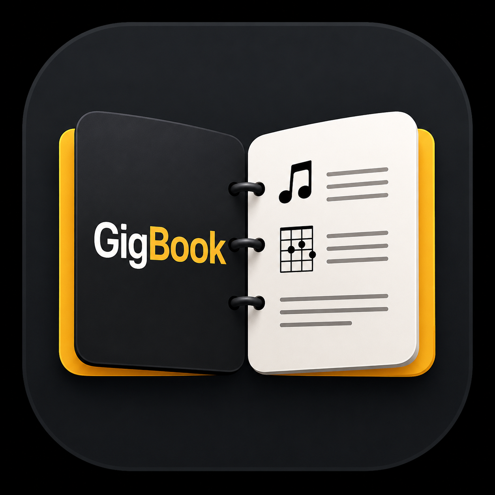

  

<h1 align="center">GigBook</h1>

GigBook is an offline-first Flutter app for musicians who need fast, reliable access to lyrics
and chords on stage. Import ChordPro charts, organize them into setlists, and perform from a
dark, large-text display — no network connection required.

## Major Features

- **ChordPro library** — import individual files or whole folders (`.cho`, `.crd`, `.pro`,
  `.txt`), browse and search your songs, mark favorites.
- **Full ChordPro tag support** — metadata, sections, annotation lines, text color/highlight,
  and live metadata references. See the [quick reference](#chordpro-tag-quick-reference) below.
- **Setlists** — build ordered setlists for a gig, reorder by drag-and-drop, and step through
  songs in order while performing. Setlists can be exported/imported as JSON to share with other
  band members.
- **Stage-ready display** — adjustable font size, chords on/off toggle, auto-scroll with
  tempo-synced speed, and a high-contrast dark theme designed for low-light stages.
- **Custom themes** — design your own color scheme (background, text, chords, section headers,
  comments) with a live preview, with saves blocked if a color pair falls below readable
  contrast. Save multiple named themes, switch between them from Settings, and share/import
  themes as JSON files with other GigBook users.
- **Google Drive sync** — link a Drive folder to pull in charts and setlists, push local edits
  back, and get flagged on conflicting remote changes instead of silently overwriting them.
- **Live session** — host or join a nearby live session (via Nearby Connections) so a whole band
  can follow the same "now playing" song and scroll position from the leader's device.

## ChordPro tag quick reference

The tags you'll use most often. All tag and directive names are case-insensitive. Full technical
grammar (annotation styles, inline spans, live metadata, custom directives, and more):
[`specs/001-chordpro-tag-support/contracts/chordpro-directive-grammar.md`](specs/001-chordpro-tag-support/contracts/chordpro-directive-grammar.md).

**Metadata**

| Tag | Aliases | Sets |
|---|---|---|
| `{title: ...}` | `{t: ...}` | Song title |
| `{artist: ...}` | | Artist |
| `{key: ...}` | | Key |
| `{tempo: ...}` | `{bpm: ...}` | Tempo (BPM) |
| `{capo: ...}` | | Capo position |

**Sections**

| Tag | Aliases | Renders as |
|---|---|---|
| `{sov} ... {eov}` | `{start_of_verse} ... {end_of_verse}` | Verse |
| `{soc} ... {eoc}` | `{start_of_chorus} ... {end_of_chorus}` | Chorus |
| `{sob} ... {eob}` | `{start_of_bridge} ... {end_of_bridge}` | Bridge |

## Project structure

- `lib/models/` — plain Dart data models (Song, Setlist, SetlistEntry, CustomTheme)
- `lib/db/` — sqflite persistence
- `lib/services/` — ChordPro parsing, import, Drive sync, live session, setlist/theme sharing
- `lib/providers/` — app state (library, setlists, settings, sync, live session)
- `lib/theme/` — built-in Light/Dark themes and the custom-theme `ThemeData` factory
- `lib/widgets/` / `lib/screens/` — UI
- `specs/` — spec-driven feature specs, plans, and tasks (see `.specify/memory/constitution.md`
  for the project's governing principles)
